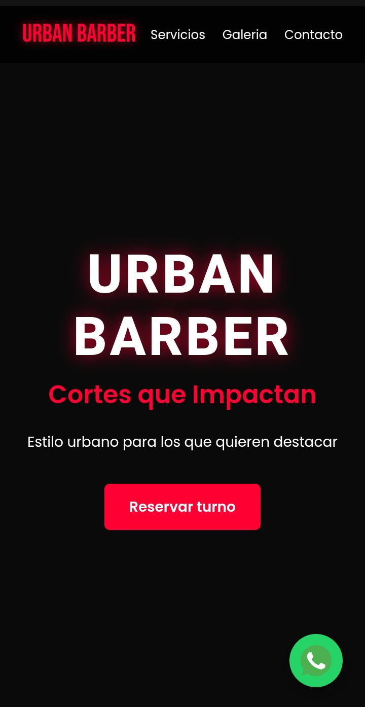

# 💈 Urban Barber - Landing Page


Landing page moderna para una barbería ficticia llamada **Urban Barber**.  
El sitio muestra servicios, galería, precios y contacto para atraer clientes.

---

## 🚀 Demo

[](https://carlosdm121.github.io/urban-barber-landing/)

---

## 🖼 Vista previa



---

## 🛠 Tecnologías

- HTML5
- CSS3
- JavaScript
- Git
- GitHub

---

## 📂 Características

✔ Diseño moderno  
✔ Sección de servicios  
✔ Galería de imágenes  
✔ Información de contacto  
✔ Diseño responsive  

---

## 📦 Instalación

```bash
git clone https://github.com/carlosdm121/urban-barber-landing.git
cd urban-barber-landing
```

Abrir:

```
index.html
```

---

## 👨‍💻 Autor

Carlos Daniel Martínez

GitHub  
https://github.com/carlosdm121
